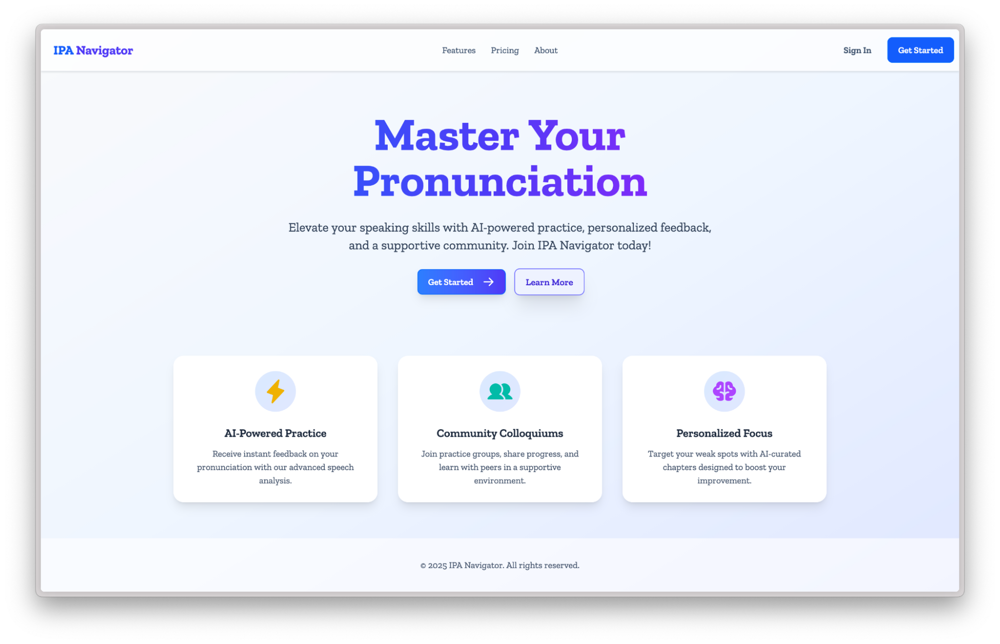
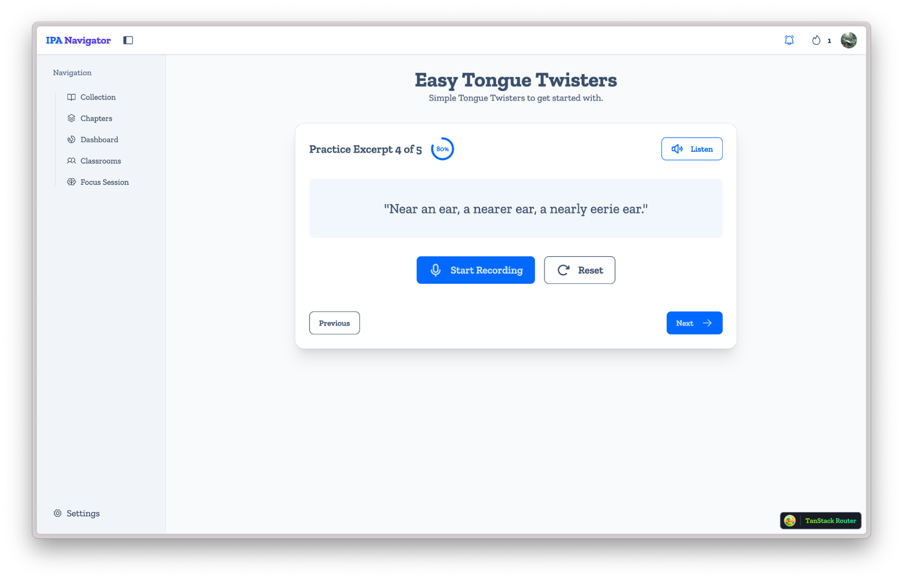
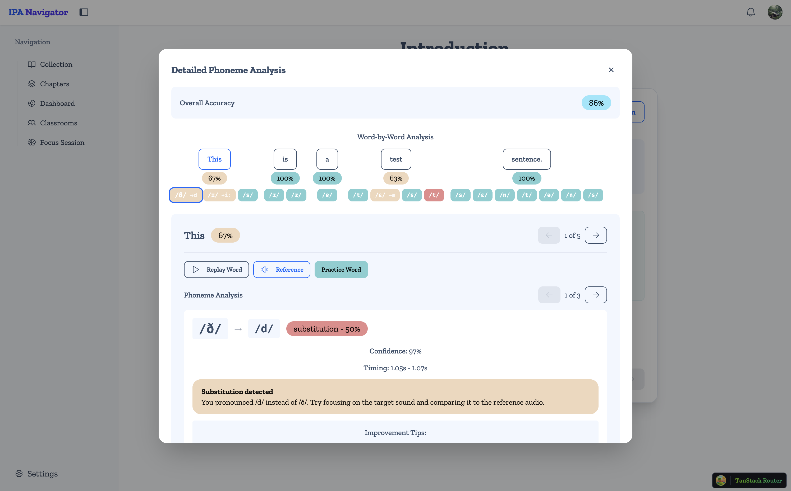
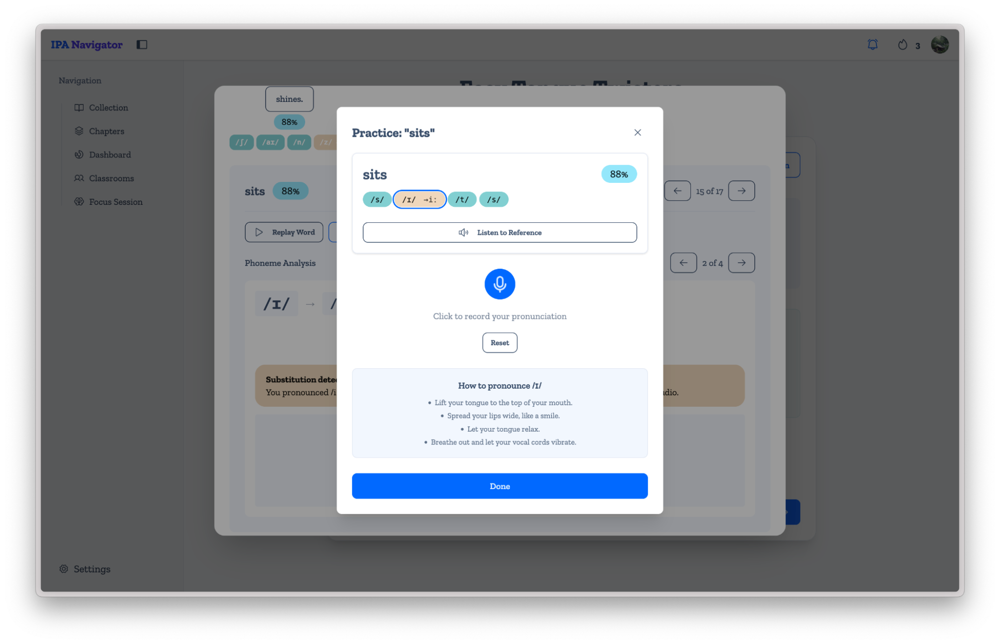
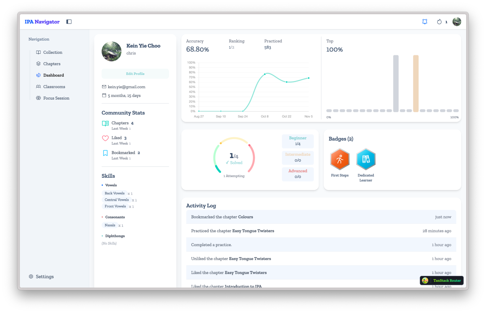
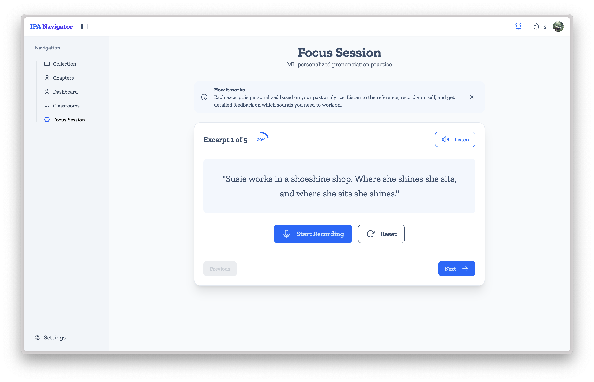
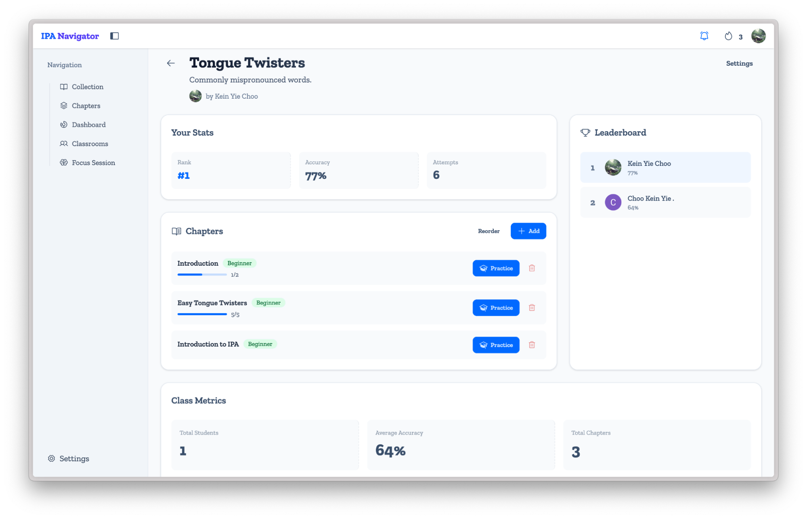

# IPA Navigator

<p align="center">
  <strong>AI-Powered Pronunciation Assistance for Non-Native English Speakers</strong><br>
  <em>Full-stack web platform delivering phoneme-level speech analysis with real-time ML personalization</em>
</p>

<p align="center">
  <a href="https://react.dev/"></a>
  <a href="https://www.rust-lang.org/"></a>
  <a href="https://fastapi.tiangolo.com/"></a>
  <a href="https://www.convex.dev/"></a>
  <a href="https://www.docker.com/"></a>
</p>

---

## 🏆 Academic Recognition

**Accepted and presented at CITIC 2026 — AI/ML Track.**  
*Paper currently in press for publication.*

This project was independently developed as a Final Year Project (BSc Computer Science, Coventry University) and subsequently accepted for presentation at the CITIC 2026 conference under the AI/ML track. The accompanying research paper documents the architectural feasibility of integrating transformer-based ASR models into a low-latency, phoneme-level pronunciation feedback system for EFL learners.

---

## 🎯 Overview

**IPA Navigator** is a full-stack web application that helps EFL (English as a Foreign Language) learners improve their pronunciation through AI-driven, phoneme-level feedback. Unlike traditional language apps that only provide generic scores, IPA Navigator analyzes speech at the individual sound level using the International Phonetic Alphabet (IPA), identifies specific articulation errors, and generates personalized practice recommendations powered by machine learning.

The system addresses a documented gap in language learning technology: while advances in Automatic Speech Recognition (ASR) have reached near-human accuracy, few platforms leverage this precision to deliver granular, actionable pronunciation feedback. IPA Navigator bridges that gap by combining state-of-the-art speech models with evidence-based engagement mechanics to reduce Foreign Language Social Anxiety (FLSA) and drive measurable improvement.

### Technical Highlights

- **Complete ML pipeline** integrating WhisperX (word alignment), wav2vec2 (phoneme extraction), and espeak-ng (IPA transcription) to deliver sub-2-second pronunciation analysis.
- **Polyglot backend architecture** deliberately splitting compute between a Python FastAPI server (speech processing) and a Rust Axum server (TTS synthesis) to optimize latency, memory safety, and concurrency.
- **Online learning recommendation engine** using Stochastic Gradient Descent that personalizes practice content based on each learner's phoneme-level accuracy history.
- **Production deployment** with Docker containerization, Deno Deploy (frontend CDN), and Heroku (backend services), handling real-time data sync via Convex.
- **Peer-reviewed and presented at CITIC 2026 (AI/ML Track)** — validated by academic review for technical contribution in applied speech systems.

---

## ✨ Key Features

| Feature | Description |
|---------|-------------|
| **🎙️ Phoneme-Level Analysis** | Records learner speech and compares detected phonemes against target IPA transcriptions, identifying substitutions, deletions, and insertions at the individual sound level. |
| **📊 Real-Time Feedback** | Returns word-level and phoneme-level accuracy scores, color-coded visual breakdowns, and articulatory improvement tips within ~1.8 seconds of audio submission. |
| **🤖 ML-Personalized Focus Sessions** | Uses a global SGD model with per-user feature vectors to recommend excerpts targeting each learner's weakest phonemes, optimizing for the "zone of proximal development." |
| **📈 Progress Dashboard** | Tracks overall accuracy, mastered phonemes, practice streaks, and per-phoneme proficiency with reactive real-time updates via Convex. |
| **🏫 Classroom & Social Learning** | Supports teacher-led classrooms with invite codes, chapter assignments, leaderboards, and peer progress tracking. |
| **🔊 High-Quality Reference Audio** | Generates American and British English reference pronunciations on demand using the Kokoro TTS model, with adjustable playback speed. |

---

## Application Preview


### Landing Page


*Clean, focused entry point communicating the app's core value proposition: AI-powered practice, community learning, and personalized focus.*

### Pronunciation Practice


*Minimalist recording interface designed to reduce cognitive load and speaking anxiety. Users listen to reference audio, record their attempt, and receive instant analysis.*

### Phoneme-Level Feedback


*Granular, color-coded phoneme breakdown showing exactly which sounds were correct, substituted, or deleted. Users can drill down into individual words for targeted practice.*

### Detailed Error Analysis


*Expanded feedback modal identifying specific articulation errors (e.g., /ð/ deletion) with non-judgmental guidance and concrete improvement suggestions.*

### User Dashboard


*Central analytics hub tracking accuracy over time, practice sessions, mastered phonemes, and skill breakdowns by phoneme category.*

### Focus Session


*AI-curated practice module that dynamically selects excerpts based on the user's historical performance, ensuring every session targets their actual weak spots.*

### Classrooms & Leaderboards


*Social learning environment supporting group practice, classroom management, and competitive leaderboards to drive extrinsic motivation.*

---

## 🏗 Architecture

The project is structured as a monorepo with the following components:

- **Frontend** (`src-web`): A modern React application built with Vite, TailwindCSS, and Convex. It uses Clerk for authentication and TanStack Router for navigation.
- **Backend** (`src-server`): A high-performance Rust server using the Axum framework. **KokoroTTS** is used for text-to-speech.
- **Aligner Service** (`aligner`): A Python-based service utilizing **wav2vec2** for audio alignment and **WhisperX** for word-level transcription. 

## 🚀 Getting Started

This project uses `docker-compose` for containerization and `just` as a command runner to simplify common tasks.

### Prerequisites

- [Docker](https://www.docker.com/) & Docker Compose
- [Just](https://github.com/casey/just)

### Local Development

For local development without Docker, you need the following:

1.  **System Dependencies**:
    - **Espeak-ng** must be installed locally.
    - Export the following environment variables:
        ```bash
        export PHONEMIZER_ESPEAK_LIBRARY=/path/to/libespeak-ng.dylib # (or .so on Linux)
        export ESPEAK_DATA_PATH=/path/to/espeak-ng-data
        ```

2.  **Service Startup**:
    - **Aligner** (`aligner`):
        ```bash
        uv run fastapi dev
        ngrok http 8000
        ```
    - **Backend** (`src-server`):
        ```bash
        cargo run
        ```
    - **Frontend** (`src-web`):
        ```bash
        deno run dev
        # In a separate terminal:
        cd convex && npx convex dev
        ```

> [!NOTE]
> When developing locally, the endpoint APIs fallback to localhost. However, you **MUST** set the `PYTHON_API_URL` in your Convex Dashboard to the `ngrok` endpoint (e.g., `https://xxxx.ngrok-free.app`) so the cloud function can reach your local aligner.

### Docker Commands

- **Start Development Environment**:
  ```bash
  just dev
  ```
  This spins up the services in development mode. The website will be available at `http://127.0.0.1:5173`.

  > [!IMPORTANT]
  > **Convex Connectivity**: To allow the cloud-hosted Convex instance to communicate with your local Aligner API, you **MUST** run ngrok manually:
  > ```bash
  > ngrok http 8000
  > ```
  > Then, set the `PYTHON_API_URL` environment variable in your Convex dashboard or pass it when running `npx convex dev`.

- **Start Production Environment**:
  ```bash
  just prod
  ```
  Runs the application in production mode. The website will be available at `http://127.0.0.1:4173`.

- **Stop Services**:
  ```bash
  just stop
  ```
  Stops all running containers.

- **Clean Up**:
  ```bash
  just nuke
  ```
  Stops containers and removes all volumes (useful for a fresh start).

## 📂 Project Structure

```
├── aligner/        # Python wav2vec2/WhisperX alignment service
├── src-server/     # Rust Axum backend server
├── src-web/        # React/Vite frontend application
├── docker-compose.yml      # Production docker-compose config
├── docker-compose.dev.yml  # Development docker-compose config
└── justfile        # Command runner configuration
```

## 🔧 Development

- **Frontend**: Located in `src-web`. Run `npm install` (or `pnpm`/`yarn`) inside the directory to install dependencies locally if needed.
- **Backend**: Located in `src-server`. Standard Rust project structure.
- **Aligner**: Located in `aligner`. Python project using `uv` for dependency management.
